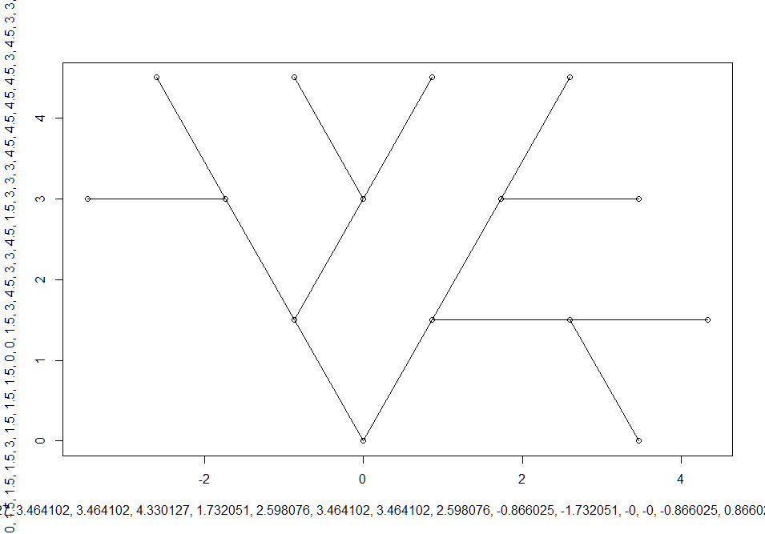

# triangle_trees
Binary trees overlaid on a triangular tessellation of the plane.

The euclidean plane can be tessellated by only 3 regular polygons. Namely, the triangle, the square and the hexagon. To the vertices of a triangular tessellation of the plane, we may associate nodes of a binary tree whose edges are the sides of the triangles themselves.
I've written a C++ program to find all the unique ways a complete binary tree may be represented in such a triangular tessellation under translational, rotational, and reflective equivalence.

Tried the first time on Ada. Observed the results (Degree 1: 30, Degree 2: 7728, then memory saturation)
and translated to C++. Same result.

Modified the C++ code to look for strictly unique trees under translation, rotation and reflection.

Reads:
 Number of Trees of Degree 1: 3
 Number of Trees of Degree 2: 230

But for the third degree, the Reduce() function has to manage over three million trees, taking about one minute per tree on my computer. This means it would take about 6 years to just return the reduced list of trees of degree 3.

Limited the trees to those whose children have an angle of 60 degrees.
 Number of Trees of Degree 1: 1
 Number of Trees of Degree 2: 8
 Number of Trees of Degree 3: 206

